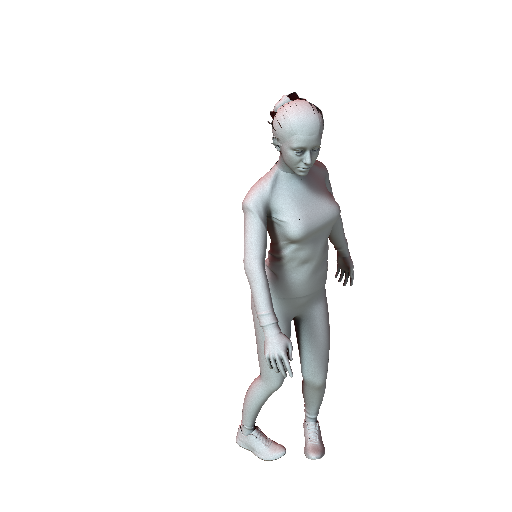

# CUDA Ray Tracing using BVH



**[WIP] Supporting Ray-Triangle Intersection -> Ray Tracing on CUDA.**

This is a fork from: https://github.com/YuliangXiu/bvh-distance-queries

This package provides a PyTorch module that performs ray to surface queries on the GPU

**Please ignore the readme below for now.**

## Table of Contents

- [CUDA Ray Tracing using BVH](#cuda-ray-tracing-using-bvh)
  - [Table of Contents](#table-of-contents)
  - [License](#license)
  - [Description](#description)
  - [Installation](#installation)
  - [Examples](#examples)
  - [Dependencies](#dependencies)
  - [Example dependencies](#example-dependencies)
  - [Running on Cluster](#running-on-cluster)
  - [Citation](#citation)
  - [Contact](#contact)

## License

Software Copyright License for **non-commercial scientific research purposes**.
By downloading and/or using the Model & Software (including downloading, cloning,
installing, and any other use of this github repository), you acknowledge that
you have read these terms and conditions, understand them, and agree to be bound
by them. If you do not agree with these terms and conditions, you must not
download and/or use the Model & Software. Any infringement of the terms of this
agreement will automatically terminate your rights under this
[License](./LICENSE).

## Description

This repository provides a PyTorch wrapper around a CUDA kernel that implements
the method described in [Maximizing parallelism in the construction of BVHs,
octrees, and k-d trees](https://dl.acm.org/citation.cfm?id=2383801). More
specifically, given a batch of meshes it builds a
BVH tree for each one, which can then be used for distance quries.

## Installation

Before installing anything please make sure to set the environment variable
_$CUDA_SAMPLES_INC_ to the path that contains the header `helper_math.h` , which
can be found in the [CUDA Samples repository](https://github.com/NVIDIA/cuda-samples).
To install the module run the following commands:

**1. Install the dependencies**

```Shell
pip install -r requirements.txt
```

**2. Run the _setup.py_ script**

```Shell
python setup.py install
```

If you want to modify any part of the code then use the following command:

```Shell
python setup.py build develop
```

## Examples

-   [Random points to surface](./examples/random_points_to_surface.py): Generate
    random points and compute their distance to a mesh. Use:
    ```Shell
    python examples/random_points_to_surface.py --mesh-fn MESH_FN --num-query-points 100000
    ```
-   [Fit a cube to a cube](./examples/fit_cube_to_cube.py): Randomly translate
    and rotate a cube then fit it to the original, without using the
    correspondences by using the point to mesh distances.

    ```Shell
    python examples/fit_cube_to_cube.py
    ```

-   [Fit a cube to random points](./examples/fit_cube_to_random_points.py):
    First generate a set of random points and compute their convex hull, which
    gives us a dummy scan. We then try to rigidly align a cube to this scan using
    the provided point-to-mesh residuals.
    ```Shell
    python examples/fit_cube_to_random_points.py
    ```

## Dependencies

1. [PyTorch](https://pytorch.org)

## Example dependencies

1. [open3d](http://www.open3d.org/)
1. [mesh](https://github.com/MPI-IS/mesh)

## Running on Cluster

If you want to run this on the cluster you need to build it using the GPU availabe on the cluster. If you use the local build there might be GPU architecture compatibility issue and you can encounter following error message

```
RuntimeError: parallel_for failed: unrecognized error code: unrecognized error code
```

## Citation

If you find this code useful in your research please cite the relevant work(s) of the following list:

```
@inproceedings{Karras:2012:MPC:2383795.2383801,
    author = {Karras, Tero},
    title = {Maximizing Parallelism in the Construction of BVHs, Octrees, and K-d Trees},
    booktitle = {Proceedings of the Fourth ACM SIGGRAPH / Eurographics Conference on High-Performance Graphics},
    year = {2012},
    pages = {33--37},
    numpages = {5},
    url = {https://doi.org/10.2312/EGGH/HPG12/033-037},
    doi = {10.2312/EGGH/HPG12/033-037},
    publisher = {Eurographics Association}
}
```

## Contact

The code of this repository was implemented by [Vassilis Choutas](vassilis.choutas@tuebingen.mpg.de).
For commercial licensing, please contact [ps-licensing@tue.mpg.de](ps-licensing@tue.mpg.de).
